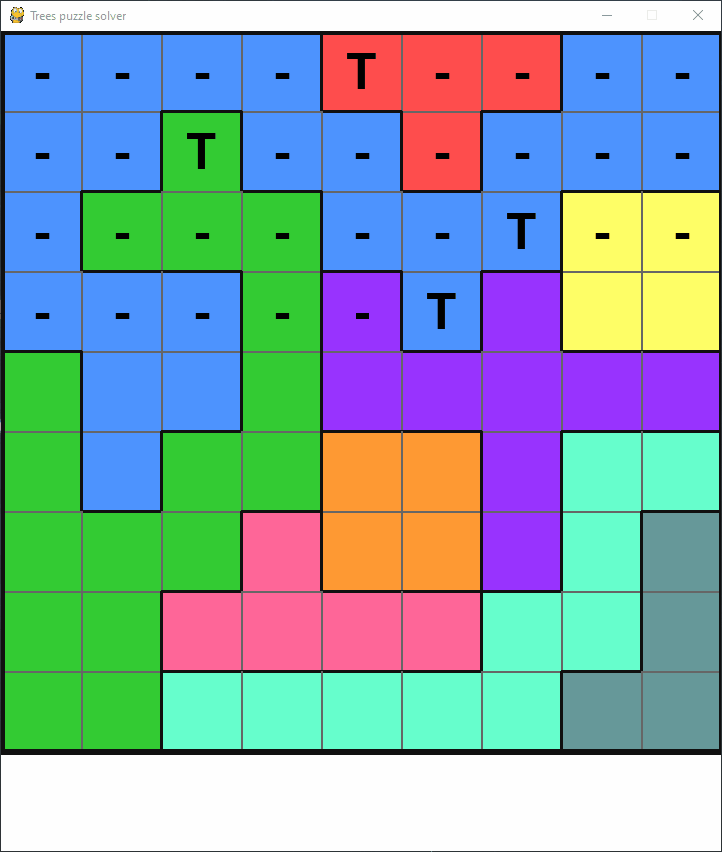

# trees-logic-puzzle-solver
GUI solver for Katie_Wandering's Trees Logic Puzzles using a backtracking algorithm \
https://www.sporcle.com/user/Katie_Wandering/playlists/

### Usage (windows)

1. Create a virtual environment `py -m venv venv`
1. Activate virtual environment `.\venv\Scripts\activate`
1. Install packages `pip install -r requirements.txt`
1. Run `py run.py`
1. Enter desired board size (1-10)
1. Fill in board using arrow and number keys
1. Press Enter to confirm
1. Press Enter to solve

### Required packages
1. Numpy
1. Pygame

### Demo

